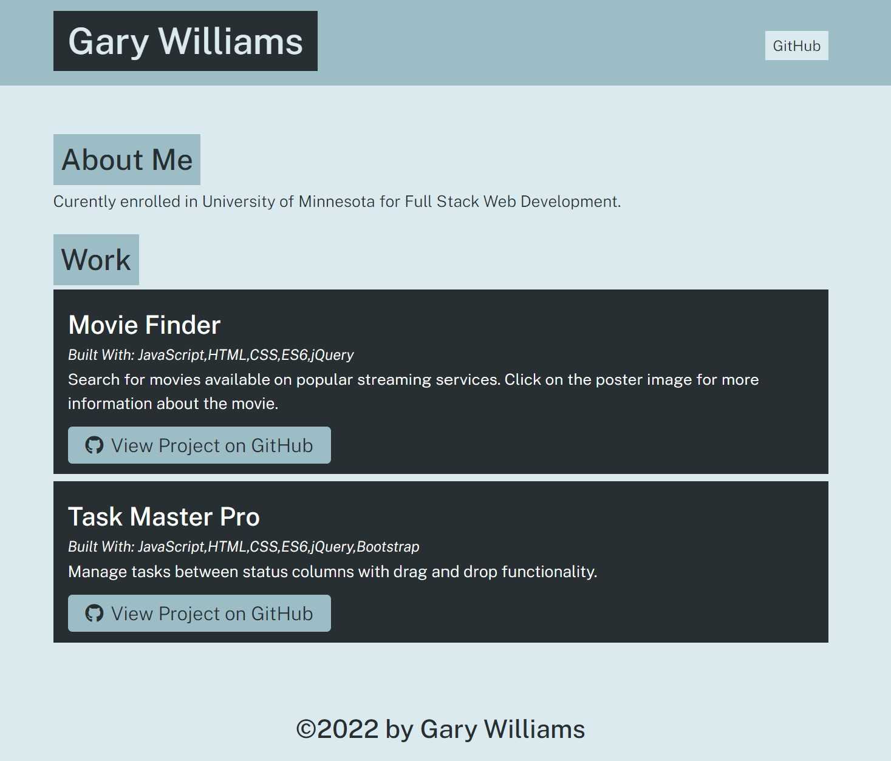

# portfolio-generator

This is a Node.js program that generates a portfolio page based on the users input.

## Image

## Review

* GitHub repository: https://github.com/willig0203/Portfolio-Generator

## Contribution

Gary Williams (Trademark GarywareLLC).